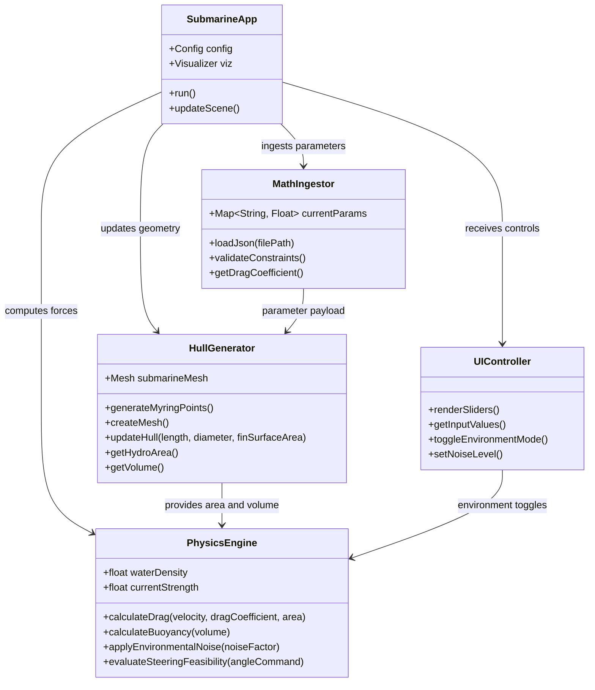

# Submarine Simulation - Phase 1 Class Diagram

## Implementation Rationale

1. `MathIngestor`
- Acts as the contract boundary with the math partner.
- Uses JSON payloads so formula and coefficient updates do not require code rewrites.
- Performs constraint validation before geometry or physics updates.

2. `HullGenerator` (Open3D core)
- Converts validated parameters into hull and fin geometry.
- Supports base case (ideal smooth body) and real case (surface roughness influence).
- Exposes computed area/volume so physics remains decoupled from rendering internals.

3. `PhysicsEngine`
- Owns force calculations and environment effects independent of mesh rendering.
- Implements drag and buoyancy using explicit equations and scenario inputs.
- Validates whether steering commands remain physically feasible under resistance/current.

4. `UIController`
- Provides parameter sliders and scenario toggles (base vs. real environment).
- Injects controlled error/noise for robustness testing (for example, +/-5% sensor jitter).
- Sends only interaction state; simulation logic stays in domain classes.

## Core Equation
`F_drag = 0.5 * rho * v^2 * C_d * A`

Where:
- `rho` = fluid density (changes with environment mode)
- `v` = relative velocity
- `C_d` = drag coefficient
- `A` = reference area
